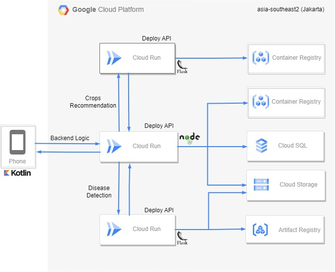

# Teman Tani ML Deployment

## Team Profile

### Team ID		: C23-PS275  
### Team Member	:   
(ML) M181DSX0178 – Fikri Aufaa Zain – Universitas Indonesia  
(ML) M309DSY1304 – Hana Fatimah Zahra – Universitas Pendidikan Indonesia  
(CC)  C360DSX3567 – Ahmad Alfarel – Telkom University  
(CC)  C360DSY3708 – Tiara Firdausa Abdillah – Telkom University  
(MD) A030DSX3481 – Guntur Augustin Sinaga –Institut Teknologi Del  
(MD) A360DKX4504– Henzi Juandri – Telkom University  

### Overview
This is a code for Teman Tani machine learning deployment. We using Cloud Run on Google Cloud Platform for the deployment and we using Flask to make the API endpoint for Backend can access the model. We also using Docker to make the container for the deployment.

### How to deploy
1. Clone this repository
2. Install the Google Cloud SDK
3. Go to the directory where you clone this repository
4. Choose the folder that you want to deploy (Disease or Recommendation)
5. Go to the folder that you choose
6. Run this coommand `gcloud run deploy` 
7. After that put the necessary name for the service
8. Choose the region that you want to deploy (Our use asia-southeast2 - Jakarta)
9. And you are done  

### Our Architecture

### Documentation
- https://cloud.google.com/run/docs/quickstarts/build-and-deploy/deploy-python-service  
- https://cloud.google.com/run/docs/deploying-source-code  

